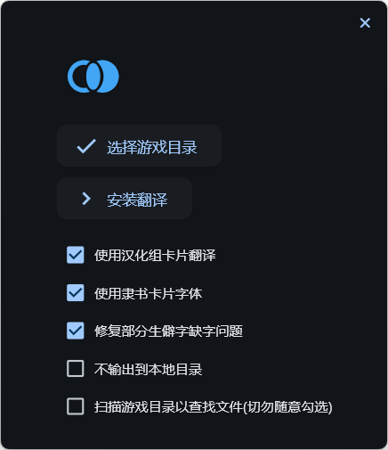

<h1 align="center">Master Duel 社区中文翻译补丁</h1>
<div align="center">


[原项目地址](https://gitee.com/fetiss/master-duel-chinese-switch) | [原发布页](https://www.bilibili.com/read/cv21869124) | [API来源](https://ygocdb.com/)
  
</div>

自2023年5月初版本起，MD修改了缓存文件的调用方式，原有的翻译补丁失效，故在原项目的基础上进行了修改。

本项目是在作者 [@叶lf](https://space.bilibili.com/23834819) / [@Timelic](https://space.bilibili.com/8664322) 工作的基础上进行的，在此表示感谢！另感谢 [@拓王神](https://space.bilibili.com/483116312) 对数据解析部分提供的支持。

## 使用方式
前往[Releases页面](https://github.com/mikualpha/master-duel-chinese-switch/releases)下载`MDTR_vx.x.x.exe`，同时参考本项目[Wiki](https://github.com/mikualpha/master-duel-chinese-switch/wiki)页面使用。

## 关于项目
本项目基于`AGPL-3.0`协议开源，任何分发、修改行为请务必遵守[开源协议](https://www.chinasona.org/gnu/agpl-3.0-cn.html)。本项目的Release页面为项目唯一发布源，不存在任何官方群组，不会在第三方平台发布可执行文件，不会在第三方平台提供任何购买、捐赠、打赏等付费入口，谨防木马病毒感染或上当受骗。

如果出现报错或闪退可提`issue`，**欢迎有兴趣的童鞋提PR~**

**若认为此项目对您有帮助可考虑给项目点个`Star`，谢谢~**

## 开发相关
本项目使用 `UnityPy` 解包，使用 `flet` 制作界面。编译环境为`Python 3.10`。

<div align="center">
  
</div>

#### 准备

```
pip install -r requirements.txt
```

#### 开发

无界面

```
python3 index.py
```

flet 界面

```
flet run interface.py
```

#### 打包

PowerShell:

```
./release.ps1
```
