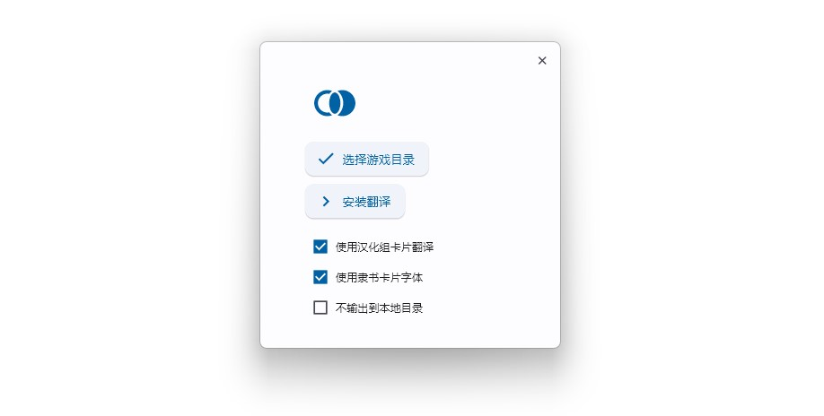

<h1 align="center">Master Duel 社区中文翻译补丁</h1>
<div align="center">


[原项目地址](https://gitee.com/fetiss/master-duel-chinese-switch) | [原发布页](https://www.bilibili.com/read/cv21869124) | [API来源](https://ygocdb.com/)
  
</div>

自2023年5月初版本起，MD修改了缓存文件的调用方式，原有的翻译补丁失效，故在原项目的基础上进行了修改。

本项目是在作者 [@叶lf](https://space.bilibili.com/23834819) / [@Timelic](https://space.bilibili.com/8664322) 工作的基础上进行的，在此表示感谢！另感谢 [@拓王神](https://space.bilibili.com/483116312) 对数据解析部分提供的支持。

## 使用方式
前往[Releases页面](https://github.com/mikualpha/master-duel-chinese-switch/releases)下载`MDTR_vx.x.x.exe`，同时参考本项目README和原项目发布页使用。

### 注意事项
1. 因为文件结构发生了变化，使用本地替换的话请把`output`下的所有文件夹替换至游戏目录`LocalData`文件夹下（在粘贴时应当有覆盖提示）；

2. 原版文件备份存储于`EXE`文件同目录下的`_TranslationBackup`文件夹内，只有进行过汉化翻译安装才有备份，所以没进行过汉化的无法进行一键翻译恢复，这点需要注意；

3. 当**游戏版本更新**，需要重新安装翻译时**请删除补丁同目录下的`_TranslationBackup`文件夹**（不然可能有未知问题）；

4. 若在安装后需要更改字体设置等，请先连同翻译还原为官方版本（取消软件内所有勾选后安装），再重新按正常安装流程操作。

### 未解决的问题
1. 暂时只支持在源语言是`简体中文`的情况下进行转换，因为现在MD切换语言会把之前的语言文件删掉，暂时没想到有什么可以跨语言对照文本的方法；

2. 因本项目所用的API不提供衍生物的翻译文本，故所有衍生物卡片均不会被转换为社区翻译。

### 版本更新时推荐的更新方式
以下流程可以在游戏需要小规模更新（客户端版本号没有更改）的情况下快速进行更新而不需要多次重启客户端或覆盖还原文件，仅`V1.6.1`以上版本支持：
1. 打开游戏发现有更新，在`需要更新XX.XXM文件`对话框处暂停，打开汉化补丁；
2. 把汉化补丁所有选项去除勾选，点击`安装翻译`，等待执行完毕；
3. 提示成功后删除`_TranslationBackup`文件夹，回到游戏界面点击确定进行更新；
4. 等待更新文件下载完毕，待`START`按钮亮起时暂停，回到汉化界面；
5. 把勾选框恢复原状，点击`安装翻译`，等待执行完毕（若此环节报错则说明本次更新不属于小规模更新，不适用此种方式）；
6. 回到游戏界面，点击`START`按钮，进入游戏。

PS：如果某环节忘记暂停或发现漏做，请直接放弃此方式而改用常见手段重新安装，以免造成不必要的文件损坏。

### 常见问题FAQ
#### Q: 翻译流程执行的速度太慢/翻译过程中提示网络错误是什么情况？
A: 尝试进行以下步骤：
1. 进入游戏确认目前是官方原版中文的状态，确认自己在安装翻译前已经删除`_TranslationBackup`文件夹；
2. 把EXE文件移动到SSD下，已经在SSD的尝试把EXE换一个地方放（哪怕只是不同文件夹）；
3. 确认自己的设备可以正常打开[API页面](https://ygocdb.com/)，尝试暂时关闭安全软件（360、电脑管家等）以减少干扰，确认以上条件正常后打开EXE文件重试。

注：步骤1~3均无效时，可尝试下面这个问题的解释和操作步骤（~~重装解决90%的问题~~）。

#### Q: 提示安装失败/安装后卡片和描述文本对不上怎么办？
A: 可能官方在更新后残留了部分旧文件，也有可能在之前版本中被安装过旧版本补丁或其它MOD，导致取得的翻译文件格式不是官方标准格式，软件按流程处理后索引出现错位。
1. 可尝试下载`Recovery.zip`覆盖到`LocalData/[随机8位16进制数]/0000`文件夹下再试；
2. 若仍无效，可尝试删除游戏目录`LocalData`下所有文件夹（留个空的`LocalData`），重新打开游戏客户端下载缓存文件后再试。

----
在FAQ的结尾想分享这样一句话：`90%开源开发者的热情是在回复低质量问题时被磨灭的。`

若以上FAQ无法解决问题可尽管提`issue`，但希望在向开发者反馈时（无论是任何开发者的任何项目）能提供尽可能丰富的信息以帮助复现和解决问题。

## 关于项目
本项目基于`AGPL-3.0`协议开源，任何分发、转载、修改行为请务必遵守[开源协议](https://www.chinasona.org/gnu/agpl-3.0-cn.html)。本项目的Release页面为项目唯一发布源，不存在任何官方群组，不存在社交平台账号同时发布的情形，不存在任何诸如购买、捐赠、打赏等付费入口，谨防木马病毒感染或上当受骗。

如果出现报错或闪退可提`issue`，**欢迎有兴趣的童鞋提PR~~~**

**若认为此项目对您有帮助可考虑给项目点个`Star`，谢谢~**

## 开发相关
本项目使用 `UnityPy` 解包，使用 `flet` 制作界面。编译环境为`Python 3.10`。


#### 准备

```
pip install -r requirements.txt
```

#### 开发

无界面

```
python3 index.py
```

flet 界面

```
flet run interface.py
```

#### 打包

PowerShell:

```
./release.ps1
```

## 题外话
因为开发环境没有接`Gitee`(外加发`Releases`没有`GitHub`友好)，所以把库拉到`GitHub`来修改了……严格意义来说并不符合开源礼仪，还请原作者大大见谅Orz
